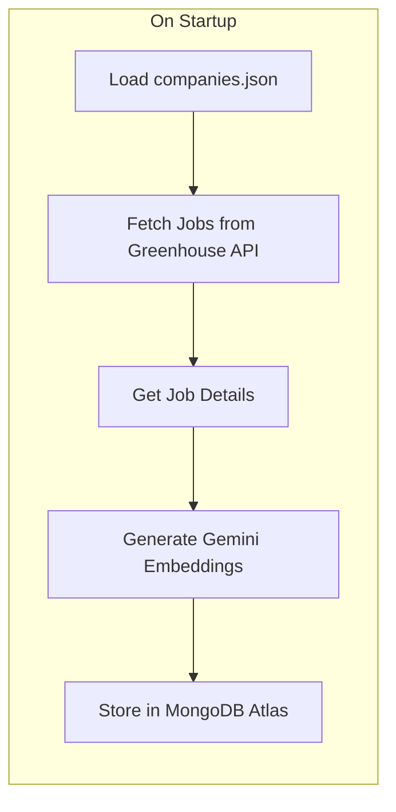

# Greenhouse Job Scraper with Vector Embeddings

## Architecture



## Data Flow

1. Load 36 companies from [`services/headless/data/companies.json`](services/headless/data/companies.json)
2. For each company, fetch up to 10 jobs from `https://boards-api.greenhouse.io/v1/boards/{token}/jobs`
3. For each job, fetch full details from `https://boards-api.greenhouse.io/v1/boards/{token}/jobs/{job_id}`
4. Combine title + location + department + description into text, generate 768-dim embedding
5. Upsert job documents with embeddings into MongoDB collection `jobs`

## MongoDB Document Schema

```python
{
    "_id": ObjectId,
    "greenhouse_id": int,           # Greenhouse job ID
    "company_token": str,           # e.g., "reddit"
    "company_name": str,            # e.g., "Reddit"
    "title": str,                   # Job title
    "location": str | None,         # Location name
    "department": str | None,       # Department name
    "description_html": str,        # Raw HTML description
    "description_text": str,        # Plain text for display
    "absolute_url": str,            # Link to apply
    "updated_at": datetime,         # Greenhouse updated_at
    "scraped_at": datetime,         # When we scraped it
    "embedding": list[float],       # 768-dim vector
}
```

## Files to Create/Modify

| File | Action |

| ---------------------------------------------------------------------------- | ------------------------------------------------- |

| [`services/headless/requirements.txt`](services/headless/requirements.txt) | Add `google-generativeai` and `beautifulsoup4` |

| [`services/headless/app/db.py`](services/headless/app/db.py) | MongoDB connection + job upsert functions |

| [`services/headless/app/greenhouse.py`](services/headless/app/greenhouse.py) | Greenhouse API client (fetch jobs, fetch details) |

| [`services/headless/app/embeddings.py`](services/headless/app/embeddings.py) | Gemini embedding wrapper |

| [`services/headless/app/scraper.py`](services/headless/app/scraper.py) | Main scraper orchestration logic |

| [`services/headless/app/main.py`](services/headless/app/main.py) | Add startup event to trigger scraper |

| [`docker-compose.yml`](docker-compose.yml) | Add `GOOGLE_API_KEY` to headless service |

| [`.env.example`](.env.example) | Document required env vars |

## Key Implementation Details

-   **HTML to Text**: Use BeautifulSoup to strip HTML tags from job descriptions
-   **Embeddings**: Use `gemini-embedding-001` with `task_type="retrieval_document"` and `output_dimensionality=768`
-   **Upsert Logic**: Use `greenhouse_id` as unique key to avoid duplicates on restart
-   **Configurable Limit**: Add `JOBS_PER_COMPANY` env var (default 10)
-   **Async**: Use `httpx.AsyncClient` for concurrent API calls and `motor` for async MongoDB
